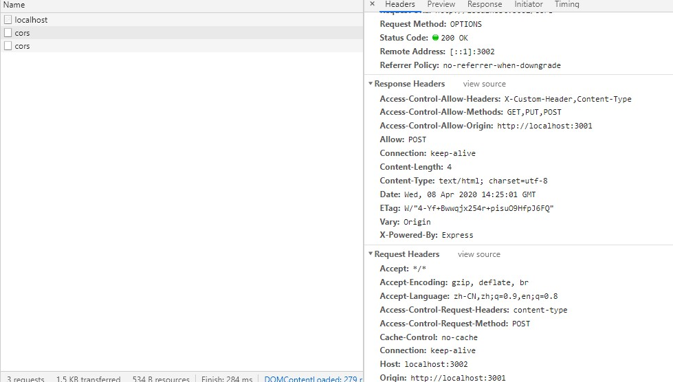

CORS 跨域资源共享是一种使用 XMLHttpRequest 实现跨域请求 的方法，CORS 请求分为两种

## 简单请求

### 请求方法必须为以下方法

- GET
- POST
- HEAD 请求 Response 不会返回 body

### 只能手动设置以下头部字段

- Accept
- Accept-Language
- Last-Event-ID Sever Sent Event 事件 ID，用于连接断开之后再次找到对应的事件恢复连接
- Content-Type

另外还可以包括 HTTP Client Hints 相关的字段

- DPR
- Width 图片宽度
- Viewport-Width
- Svae-Data 值为 On 时表示客户端偏好简化的数据，较小尺寸、压缩图片

#### Content-Type 只能是以下类型之一

- application/x-www-form-urlencoded

表单 POST 时默认的资源类型，值形式为 a=1&b=2

- multipart/form-data

Content-Type: multipart/form-data

```js
boundary=----WebKitFormBoundaryI26Ec4f1hSPAyBfH

------WebKitFormBoundaryI26Ec4f1hSPAyBfH
Content-Disposition: form-data; name="a"

1
------WebKitFormBoundaryI26Ec4f1hSPAyBfH
Content-Disposition: form-data; name="b"

2
------WebKitFormBoundaryI26Ec4f1hSPAyBfH--
```

- text/plain

简单请求以外的都是非简单请求，CORS 对两种请求处理方式不一样，对非简单请求需要先通过一次预检请求，服务端接收预检请求返回同意跨域请求，客户接收返回后再次发送真实请求获取数据;而简单请求只需一次就能完成。

通过上面简单请求的条件，可以确定平时经常用的`application/json`资源类型属于非简单请求

## 简单请求流程

简单请求直接发送真实请求，不需要先发送预检请求，请求头部字段中除了会自动添加`Origin`字段外不会添加其他`Access-Control`字段;且响应头中也没有包含`Methods`、`Headers`字段

```js
// Request
var xhr = new XMLHttpRequest();
xhr.open('POST', 'http://localhost:3002/cors-simple-request');
xhr.send();
xhr.addEventListener('load', function() {
  console.log(xhr.responseText);
});

// Response
app.all('/cors-simple-request', function(req, res, next) {
  res.setHeader('Access-Control-Allow-Origin', '*');
  res.setHeader('Access-Control-Allow-Credentials', true);
  res.json({ msg: 'This is CORS-enabled' });
});
```

```js
// Request
POST /cors-simple-request HTTP/1.1
Host: localhost:3002
Connection: keep-alive
Content-Length: 0
Pragma: no-cache
Cache-Control: no-cache
Origin: http://localhost:3001
Sec-Fetch-Dest: empty
User-Agent: Mozilla/5.0 (Windows NT 10.0; Win64; x64) AppleWebKit/537.36 (KHTML, like Gecko) Chrome/80.0.3987.163 Safari/537.36
Accept: */\*
Sec-Fetch-Site: same-site
Sec-Fetch-Mode: cors
Referer: http://localhost:3001/
Accept-Encoding: gzip, deflate, br
Accept-Language: zh-CN,zh;q=0.9,en;q=0.8

// Response
Access-Control-Allow-Credentials: true
Access-Control-Allow-Origin: *
Connection: keep-alive
Content-Length: 30
Content-Type: application/json; charset=utf-8
Date: Sat, 11 Apr 2020 11:59:38 GMT
ETag: W/"1e-fV0DPlG9tiOfUtv5o/C7CtvsjgM"
Vary: Origin
X-Powered-By: Express
```

## 非简单请求处理流程

可以认为简单请求以外的请求为非简单请求，当**浏览器**发现请求是一个是跨域非简单请求，这时会先发送一个预检请求，就是问下服务端我到底能不能访问执行这个真实请求，服务端响应正常表示可以了就会再另外发一次真实请求最后获取到内容

内容一段插曲有点坑，本来想用 Express 启两个服务好测试非简单请求的，一测试死活不会发送预检请求，

结果在 Express cors 中间件的 issue 里发了现了这个
https://github.com/expressjs/cors/issues/181

> The ways CORS works is that your client (usually web browser) is what is actually deciding to make this requests, not this module. This module simply is a method to respond to the client when it does make them.<br/>
> So as for why those requests are being made -- you'll need to consult the support for your browser instead of this module. You can see for yourself that this module is not creating them by removing it from your code and then you'll still see those OPTIONS requests being sent by your client.

意思甩锅，大概是说没发预检请求不关我这个包的事，这属于浏览器机制我们管不着。根据这点继续搜索,果然

https://stackoverflow.com/questions/57410051/chrome-not-showing-options-requests-in-network-tab

https://support.google.com/chrome/thread/11089651?hl=en

https://bugs.chromium.org/p/chromium/issues/detail?id=995740#c1

- [ ] 暂时没看懂这个 issue，为什么要禁用

禁用 chrome `chrome://flags/#out-of-blink-cors`

客户端

```js
var xhr = new XMLHttpRequest();
xhr.open('POST', 'http://localhost:3002/cors');
xhr.setRequestHeader('Content-Type', 'application/json');
xhr.send(JSON.stringify({ a: 2 }));
```

服务端

```js
app.use(
  cors({
    origin: 'http://localhost:3001',
    methods: ['GET', 'PUT', 'POST'],
    allowedHeaders: ['X-Custom-Header', 'Content-Type'],
    preflightContinue: true,
  }),
);
app.post('/cors', function(req, res, next) {
  res.json({ msg: 'This is CORS-enabled' });
});
```

预检请求终于出来了



### General

- Request Method: OPTIONS

### Request

- Origin: http://localhost:3001 声明请求源包括协议、域、端口
- Access-Control-Request-Method: POST 请求方法
- Access-Contaol-Request-Headers: content-type 请求设置的头部字段

### Response

- Access-Control-Allow-Origin: http://localhost:3001
- Access-Control-Allow-Methods: GET,PUT,POST
- Access-Contaol-Allow-Headers: X-Custom-Header,Content-Type

如果服务端拒绝跨域请求，还是会以 200 响应，但是会抛出异常，也不会再次发送真实请求，所以会触发客户端 error 事件，且接收不到响应内容

> Access to XMLHttpRequest at 'http://localhost:3002/cors' from origin 'http://localhost:3001' has been blocked by CORS policy: Method DELETE is not allowed by Access-Control-Allow-Methods in preflight response. <sub>[1]</sub>

```js
var xhr = new XMLHttpRequest();
xhr.open('DELETE', 'http://localhost:3002/cors');
xhr.send();
xhr.addEventListener('load', function(e) {
  console.log('load', xhr.status, xhr.responseText);
});
xhr.addEventListener('error', function(e) {
  // xhr.status:0表示请求失败或者请求未完成
  console.log('onerror', xhr.status, xhr.statusText);
});
```

`Access-Control-Allow-Methods`不包含`DELETE`请求

```js
HTTP/1.1 200 OK
X-Powered-By: Express
Access-Control-Allow-Origin: http://localhost:3001
Vary: Origin
Access-Control-Allow-Methods: GET,PUT,POST
Access-Control-Allow-Headers: X-Custom-Header,Content-Type
Content-Type: application/json; charset=utf-8
Content-Length: 30
ETag: W/"1e-fV0DPlG9tiOfUtv5o/C7CtvsjgM"
Date: Fri, 10 Apr 2020 15:10:17 GMT
Connection: keep-alive
```

- [ ] error 中获取不到[1]具体异常信息

## CROS Request 字段

### Origin

### Access-Control-Request-Method

### Aceess-Control-Request-Headers

## CROS Response 字段

### Access-Control-Allow-Origin: origin | \*

允许访问该资源的 URI,可以设置为\*表示允许所有域的请求，但不能发送 `cookie`

### Access-Control-Allow-Methods

### Access-Control-Allow-Headers

### Access-Control-Allow-Credentials

是否允许客户携带 `Cookie` 请求,针对请求中添加了 `xhr.withCredentials`,如果同时设置了`Origin`为\*请求时会抛出下面的异常

```js
Access to XMLHttpRequest at 'http://localhost:3002/cors-all-origin' from origin 'http://localhost:3001' has been blocked by CORS policy: The value of the 'Access-Control-Allow-Origin' header in the response must not be the wildcard '*' when the request's credentials mode is 'include'. The credentials mode of requests initiated by the XMLHttpRequest is controlled by the withCredentials attribute.
```

- Access-Control-Expose-Headers

CORS 中 XMLHttpRequest 实例通过 `getResponseHeader`或者 `getAllResponseHeaders`只能获取到一些基本头部字段 `Content-Type`,`Content-Language`,`Expires`,`Cache-Control`,`Last-Modified`,`Pragma`.服务端可能通过设置 `Access-Control-Expose-Headers` 设置其他需要暴露的字段

```js
// Request
var xhr = new XMLHttpRequest();
xhr.open('POST', 'http://localhost:3002/cors-getResponseHeader');
xhr.send();
xhr.addEventListener('load', function() {
  console.log(xhr.responseText, xhr.getAllResponseHeaders());
});

// Response
app.all('/cors-getResponseHeader', function(req, res, next) {
  res.setHeader('Res-X-Header', 'value');
  res.setHeader('Access-Control-Expose-Headers', 'Res-X-Header');
  res.json({ msg: 'This is CORS-enabled' });
});
```

- Access-Control-Max-Age

## 小结

- 预检请求后的真实请求 Request 是没有像预检请求一样自动添加 Access-Control 字段，Response 也只包括一个 Access-Control-Allow-Origin
- 自定义的 Header 字段在预检请求时不会添加了头部字段中，只会在 Access-Control-Request-Headers: name1,name2
- 简单请求请求头中并没有包含`Access-Control`字段只有一个 `Origin`
